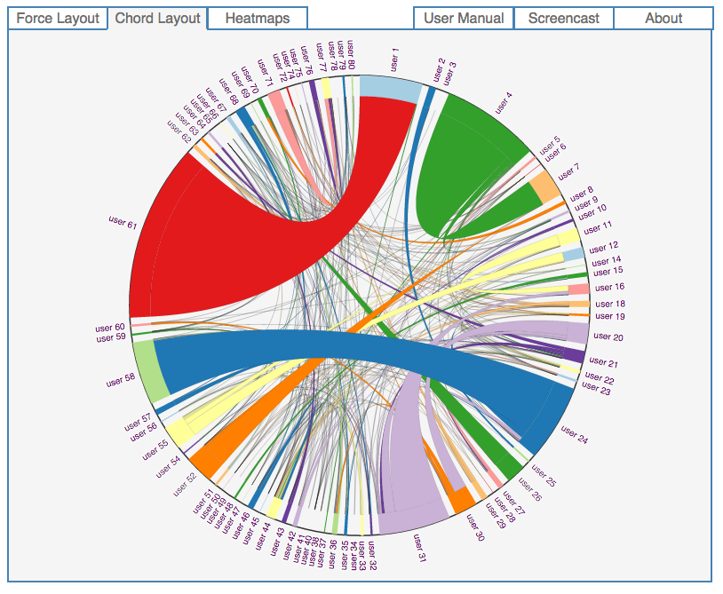
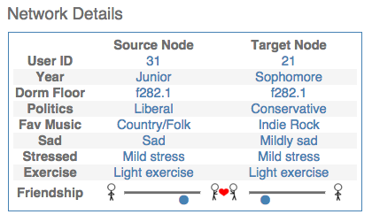

## SEE:Net - Network graph of MIT's Social Evolution Experiment

    

### [SEE:Net](http://andrewgarrettreece.com/seenet) is a window into the social lives of a group of MIT Freshmen.  

Alex Pentland's lab at MIT used phone and sensor data to closely monitor the physical and social movement of a group of Freshmen, for a whole year.  [They made their datasets public](http://realitycommons.media.mit.edu/socialevolution.html), and my team and I thought it would be a great opportunity to showcase the different ways that network graphs can be visualized.  (Teammates: [Brian Feeny](http://scholar.harvard.edu/feeny/home), [Jennifer Sulkow](https://www.linkedin.com/in/jennifer-sulkow-bb14a718))

Data visualization is often underestimated as a tool for discovery in data science.  Visuals are frequently an afterthought to the "real" work of modeling and prediction, things to put in a slide deck to show the management.  That's a mistake, in my opinion - especially when the data you're dealing with are complicated and hard to think about.  

Network graphs are a great example of data that human brains just don't represent very well, and there's real value in the exploratory phase of a project in finding good ways to visualize them.  

Check out [our screencast](https://www.youtube.com/watch?v=5vMvluLGuK8) for a brief introduction to SEE:Net.

SEE:Net shows three different views of the SEE data, using [D3](https://d3js.org/): 
- [Force-directed graph](http://bl.ocks.org/mbostock/1093130)
- [Chord diagram](http://bl.ocks.org/mbostock/1046712)
- [Heatmaps](http://bl.ocks.org/mbostock/3202354)  

We also added a simple animation function, so you can watch how the relationships in the network evolve over time.  Combining multiple views with dynamic time series information yields a visual representation of the data that would be very hard to come up with otherwise.  

